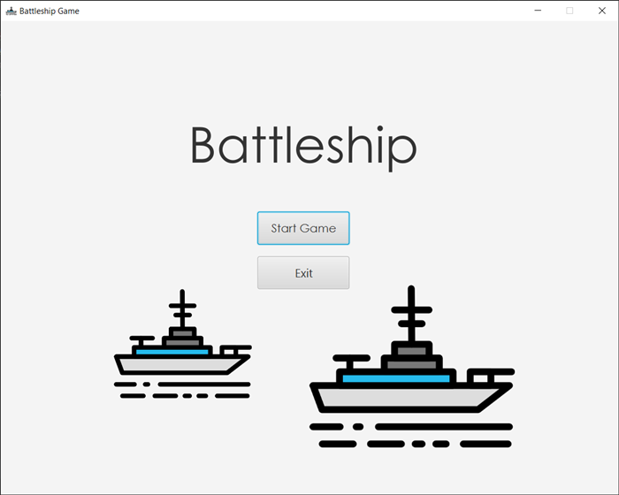
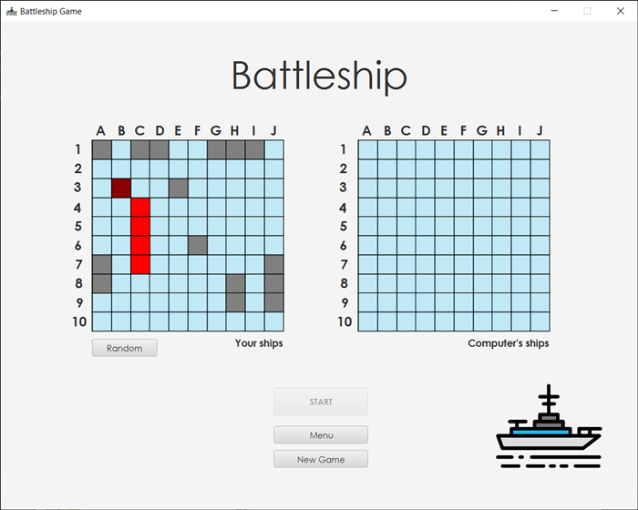
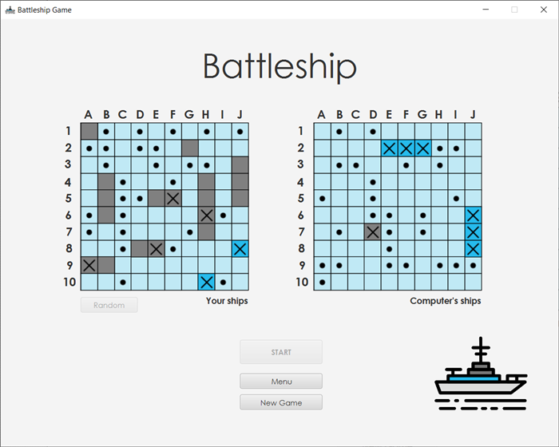

# Battleship Game
Battleship game made in Java 15 and using Java FX.

## Description
Strategy type guessing game for one player. Player's opponent is the computer. User can choose random placing of the ships or place them by himself by clicking on the ship and using arrows to move it and space bar to change its orientation. Then the user and the computer alternate turns calling "shots" at the other player's ships, and the point of the game is to destroy the opposing player's fleet. 

## Visuals

